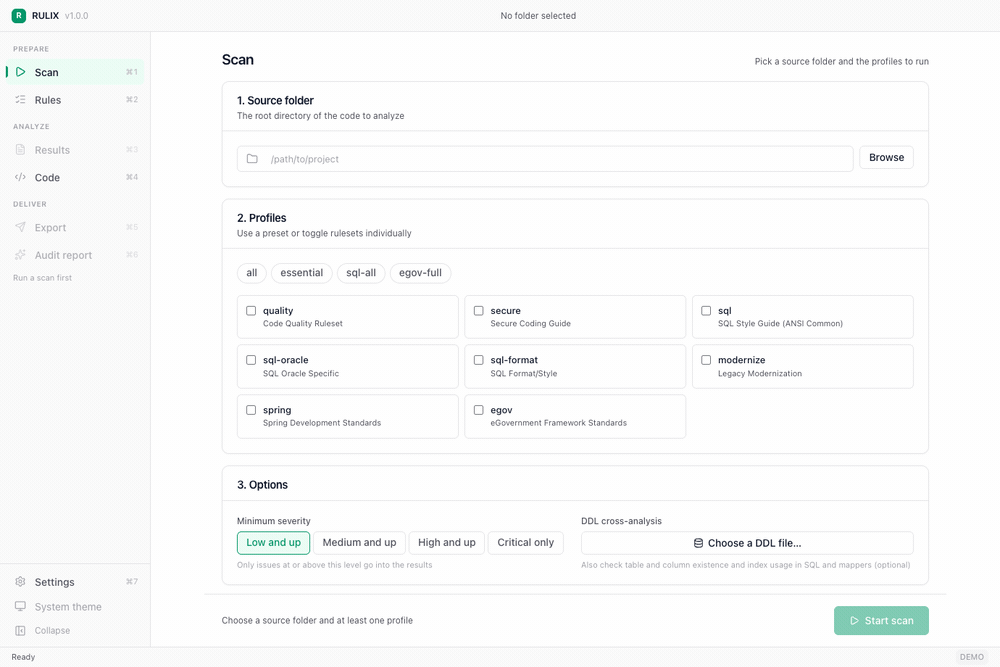
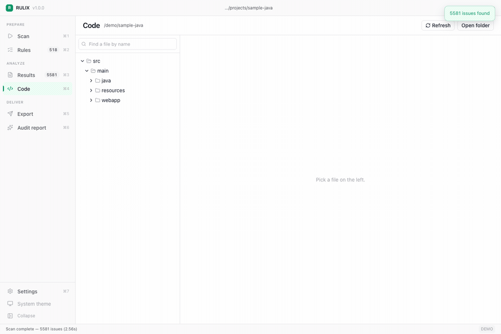
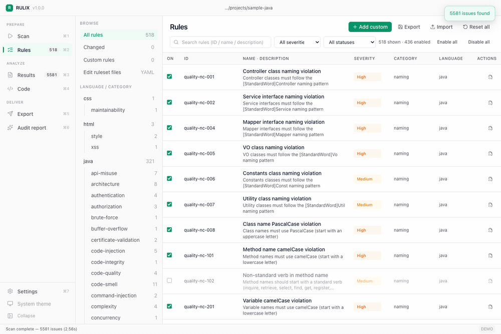

<!-- 이 파일은 rulix-releases 저장소의 루트 README 로 배포된다.
     릴리스 워크플로가 통째로 복사하므로, 배포 repo에서 직접 고치면
     다음 릴리스에 지워진다. 문구 수정은 여기서 한다.
     링크가 docs/ 로 시작하는 것은 배포 repo 루트 기준이기 때문이다. -->
# RULIX — static analysis that runs where your code cannot leave

> Static analysis for Java, JavaScript, HTML, CSS, SQL and XML. **535 rules**,
> a desktop app and a CLI over one engine, an editor built in, and **nothing
> leaves the machine**. Unzip and run — no JVM, no Node.js, no Python.

[](https://github.com/mhb8436/rulix-releases/releases/latest)
[](https://github.com/mhb8436/rulix-releases/releases)
[](#install)
[](https://www.gnu.org/licenses/agpl-3.0)

[**Download**](https://github.com/mhb8436/rulix-releases/releases/latest) ·
[Quick start](docs/QUICK_START.md) ·
[Custom rules](docs/CUSTOM_RULES.md) ·
[한국어](README.ko.md)

## Why RULIX

**It runs where your code cannot leave.** Defence, government, banking — the
places with the strictest review are the places most tools cannot go. RULIX
needs no network at all, and `--offline` enforces it: every connection to a
non-loopback address is refused at the resolved IP, DNS resolution included.
[The proof is a demo that fails on purpose first.](docs/AIRGAP_VERIFICATION.md)

**You do not bring an editor.** Browse the project, read the source with
syntax highlighting, jump from an issue to the line that caused it, fix it, and
re-check that one file — inside the app. On a site where every binary needs
approval, that is one fewer thing to get approved.

**Same answer every time.** The same source produces the same findings in the
same order. Rules that need precision are AST-based rather than text matching,
so results hold up in an audit.

**AI audit reports on your own hardware.** Any OpenAI-compatible endpoint works
— an in-house Ollama or vLLM server — so the report is written without the code
ever reaching a cloud API.

**Cross-analysis other linters skip.** Point it at your DDL and RULIX checks
every query it can find — MyBatis XML, `.sql` files, SQL embedded in Java —
against the real schema: missing indexes, composite-index leading-column skips,
columns that do not exist.

<!-- RULIX-DEMO:START -->
## Demo

### Running a scan — desktop app



A real government-framework project — 413 files, 128,497 lines — analyzed in
2.56 seconds. Paths and class names are anonymized; every number is an actual
measurement, not a mock-up.

### Reading and fixing the code — desktop app



This is the part most static analysers leave to you. Find the file by name,
open it, and every finding in it is marked in the gutter and the minimap. Step
between them with the arrows or `F8`. Press **Edit**, fix the line, save — and
RULIX re-checks **that one file** immediately: eleven findings become ten,
without re-scanning the project.

The editor is part of the app. On a site where every binary needs approval,
that is one fewer thing to get approved.

### Adding a custom rule — desktop app



Register a team convention as a regex and it is picked up on the next scan.
Paste sample code and the tester shows you the actual match before you save —
judged exactly as the scan engine judges it, so a pattern that matches here
will not come back empty in the scan.

### AI audit report with no internet access — terminal


RULIX generates the audit report through any OpenAI-compatible endpoint, so an
in-house Ollama or vLLM server works. No cloud API, no outbound connection.

`--offline` is the part that matters. It rejects every connection whose
destination is not loopback — checked at the resolved IP, so a hostname cannot
get around it, and name resolution itself is blocked too.

The recording shows the command pointed at an external endpoint **first**. It
fails, at the DNS lookup. Then the same command with only the endpoint changed
to the local server produces the report. A demo that merely works proves
nothing; a demo that fails when it should is the evidence.

Run the same two steps yourself: [Air-gap verification](docs/AIRGAP_VERIFICATION.md).

<!-- RULIX-DEMO:END -->

## Two front ends, one engine

RULIX is a desktop app and a CLI over the same rule engine. Neither is a
cut-down version of the other, and you are not meant to pick one forever.

|  | Desktop app (`rulix-gui`) | CLI (`rulix`) |
|---|---|---|
| Suited to | exploring a codebase, fixing what you find, deciding which rules apply, producing a report to hand over | CI pipelines, scheduled scans, scripted batches |
| Platforms | Windows x64, macOS (Apple Silicon / Intel) | Windows, macOS, Linux — x64, ARM64, x86 |
| Reports | Excel, HTML, JSON, AI audit report, DOCX | Console, Excel, HTML, JSON, AI audit report, DOCX |
| Rule tuning | click a toggle, test a regex live, edit the ruleset YAML with validation | YAML file, CLI flags |

The two are joined by one file. **A rule selection saved in the desktop app is
the same YAML the CLI reads**, so a decision made once by a person is what
every later automated run executes:

```
Desktop app · Rules tab          ruleset.yaml            CI · every build
  toggle rules, set severities  ──▶  save snapshot  ──▶  rulix ./src --overrides ruleset.yaml
```

That is the intended division of labour: a person decides in the GUI, the
pipeline repeats in the CLI, and the result is identical because it is the same
engine reading the same file.

## Install

Download from [Releases](https://github.com/mhb8436/rulix-releases/releases).
Each bundle is self-contained — unzip and run, nothing to install.

| Platform | Bundle | Contains |
|---|---|---|
| Windows x64 | `rulix-windows-amd64.zip` | `rulix.exe`, `rulix-gui.exe`, `rulix-report.exe` |
| macOS Apple Silicon | `rulix-darwin-arm64.tar.gz` | `rulix`, `rulix-gui`, `rulix-report` |
| macOS Intel | `rulix-darwin-amd64.tar.gz` | `rulix`, `rulix-gui`, `rulix-report` |
| Linux x64 | `rulix-linux-amd64.tar.gz` | `rulix` |
| Linux ARM64 | `rulix-linux-arm64.tar.gz` | `rulix` |
| Windows x86 | `rulix-windows-386.zip` | `rulix.exe` |
| Linux x86 | `rulix-linux-386.tar.gz` | `rulix` |

The desktop app is also published on its own, if you only want that binary:
`rulix-gui-windows-amd64.exe`, `rulix-gui-darwin-arm64`, `rulix-gui-darwin-amd64`.

**There is no desktop build for Linux.** Wails needs GTK and WebKit at build
time and we do not ship that yet — on Linux, RULIX is the CLI.

### Windows

Unzip and double-click `rulix-gui.exe`. The desktop app renders through the
Microsoft WebView2 runtime, which ships with Windows 11 and with current
Windows 10; on an older machine, install
[WebView2 Runtime](https://developer.microsoft.com/microsoft-edge/webview2/)
first. `rulix.exe` is the CLI and needs nothing.

### macOS

```bash
tar xzf rulix-darwin-arm64.tar.gz
cd rulix-darwin-arm64

# The binaries are not code-signed yet, so Gatekeeper quarantines them.
xattr -dr com.apple.quarantine .

./rulix-gui          # desktop app
./rulix --help       # CLI
```

Without the `xattr` line, macOS reports the app as damaged. Signing and
notarization are not in place yet.

### Linux

```bash
tar xzf rulix-linux-amd64.tar.gz
cd rulix-linux-amd64
./rulix ./src --profile=essential
```

## Known issues

**On macOS, the folder picker closes immediately in fullscreen.** Pressing
Browse while the window is fullscreen opens the picker and dismisses it at once.
We have not identified the cause yet. For now, **pick the folder in windowed
mode and then go fullscreen** — or paste the path into the field directly.

**The macOS binaries are not code-signed.** The first launch reports the app as
damaged. Run `xattr -dr com.apple.quarantine .` once in the folder you
extracted.

**There is no desktop build for Linux.** On Linux, RULIX is the CLI.

## Get started

### With the desktop app

1. **Scan** (`Ctrl/Cmd+1`) — pick the source folder with **Browse**, choose the
   profiles to run, set a minimum severity, and optionally point at a DDL file
   or folder to switch on cross-analysis. Press Run. Progress is shown and the
   scan can be cancelled.
2. **Results** (`Ctrl/Cmd+3`) — a dashboard of metrics and grades, plus the
   issue list. Clicking an issue opens the file at that line.
3. **Rules** (`Ctrl/Cmd+2`) — turn off rules that do not apply to this project,
   change a severity, or add a custom rule as a regex, testing it against a
   sample before saving. **Save the snapshot to a YAML file** — this is the
   file CI will use.
4. **Code** (`Ctrl/Cmd+4`) — browse the project and read the source with
   syntax highlighting. Press **Edit** to fix something; saving re-checks that
   one file immediately.
5. **Reports** (`Ctrl/Cmd+5`) — export Excel, HTML or JSON. Excel is the usual
   handover format; JSON is the input to the AI audit report.
6. **AI audit** (`Ctrl/Cmd+6`) — generate an audit report through an
   OpenAI-compatible endpoint, with air-gapped mode available. See
   [AI audit report](#ai-audit-report).

### From the command line

```bash
# Scan with every rule, straight to the console
rulix ./src --profile=all

# Quality and security only, high severity and above
rulix ./src --profile=quality,secure --min-severity=high

# Excel report — the usual handover format
rulix ./src --profile=all -o excel --output-file=report.xlsx

# HTML and JSON
rulix ./src --profile=all -o html --output-file=report.html
rulix ./src --profile=all -o json --output-file=report.json

# Reuse the rule selection made in the desktop app
rulix ./src --profile=all --overrides=ruleset.yaml -o excel --output-file=report.xlsx

# Tune on the command line instead, then save that selection for later
rulix ./src --profile=all \
  --exclude-rule quality-nc-001,sql-fmt-003 \
  --min-severity=high \
  --save-overrides=ruleset.yaml

# DDL × query cross-analysis
rulix ./src --profile=sql-ddl --ddl=./ddl/

# Korean output
rulix ./src --profile=all --lang=ko
```

> Both front ends default to English. The desktop app takes its language from
> **Settings**; the CLI takes `--lang` (`en` / `ko`), or the `RULIX_LANG`
> environment variable. Your system locale is not consulted — a tool that
> changes language depending on the machine it runs on is worse than one that
> is predictable.

## Profiles

Profiles group rules by purpose. Combine them with commas.

| Profile | What it covers | Rules | On by default |
|---|---|---|---|
| `quality` | Code quality — naming, logging, complexity, dead code | 125 | 107 |
| `secure` | Secure coding — injection, crypto, auth, error handling | 131 | 123 |
| `sql` | ANSI SQL, vendor independent | 120 | 102 |
| `sql-oracle` | Oracle specifics — NVL, hints, ROWNUM, DECODE | 20 | 18 |
| `sql-format` | SQL formatting and style | 7 | 7 |
| `modernize` | Legacy modernization — eGovFrame 3→4, javax→jakarta, iBatis→MyBatis | 50 | 39 |
| `spring` | Spring / Boot conventions | 32 | 28 |
| `egov` | eGovernment Framework standards | 33 | 12 |
| `ddl` | DDL × query cross-analysis (needs `--ddl`) | 17 | 17 |
| | **Total** | **535** | **453** |

Some rules ship switched off because they encode a team preference rather than
a defect — SQL formatting and several eGovFrame conventions, mostly. Turn them
on in the desktop app's Rules tab, or in an overrides file.

### Profile groups

| Group | Includes |
|---|---|
| `all` | quality, secure, sql, sql-oracle, sql-format, modernize, spring, egov |
| `essential` | quality, secure |
| `sql-all` | sql, sql-oracle, sql-format |
| `sql-ddl` | sql, sql-oracle, ddl |
| `egov-full` | quality, secure, sql, sql-oracle, sql-format, egov, spring |
| `migration` | modernize, spring |

Run `rulix profiles` to list them from the binary you have.

## What it checks

### Code quality (`quality`)

- Class naming — Controller, Service, ServiceImpl, Mapper, VO, Const, Util
- `System.out.println` prohibited; use a logger
- Logger string concatenation prohibited; use `{}` placeholders
- Empty catch blocks, dead code, god classes
- Method length, cyclomatic complexity
- MyBatis XML — `SQL_ID` comment required, `${}` prohibited, namespace required

### Secure coding (`secure`)

- SQL injection — `createStatement()` prohibited, use `PreparedStatement`
- XSS — `innerHTML`, `document.write`
- Command injection — `Runtime.exec()`, `ProcessBuilder` with external input
- Path traversal, SSRF, CSRF token verification
- Weak crypto — DES, MD5, SHA-1, RC4 prohibited; RSA 2048+, AES 128+
- Hardcoded passwords, keys and DB credentials
- `printStackTrace()` and `e.getMessage()` in responses

### SQL (`sql`, `sql-oracle`, `sql-format`)

- `SELECT *` prohibited, leading wildcard in `LIKE` prohibited
- Bind variables required; `UPDATE`/`DELETE` require a `WHERE`
- Code smells — `NATURAL JOIN`, `ON 1=1`, missing parentheses around `AND`/`OR`
- Oracle — hints, `NVL`/`TO_CHAR` index invalidation, `DECODE`, `ROWNUM` paging

### DDL × query cross-analysis (`ddl`)

Point `--ddl` at your DDL files and RULIX cross-checks the schema against every
SQL statement it can find — MyBatis XML, standalone `.sql` files, and SQL
embedded in Java source (`@Select`/`@Insert`/`@Update`/`@Delete`, JPA native
queries, `JdbcTemplate`, raw JDBC, and plain string literals).

- **Query correctness** — tables and columns that do not exist, JOIN type
  mismatches causing implicit conversion, `INSERT` omitting a NOT NULL column,
  `UPDATE SET` on a primary key
- **Index usage** — WHERE/JOIN/GROUP BY/ORDER BY columns with no index,
  composite index leading-column skip, functions wrapping an indexed column
- **DDL improvements** — frequently queried columns with no index, FK without
  an index, unused or duplicate indexes, missing primary keys

```bash
rulix ./src --profile=ddl --ddl=./ddl/schema.sql
rulix ./src --profile=sql-ddl --ddl=./ddl/
```

In the desktop app this is the **DDL cross-analysis** field on the Scan tab.

## AI audit report

RULIX turns a scan into a written audit report. It talks to any
OpenAI-compatible endpoint, so an in-house Ollama or vLLM server works and no
cloud API is involved.

**Desktop app** — run a scan, open the **AI audit** tab, enter the endpoint and
model, press **Test connection** to confirm the server answers, then generate.
Air-gapped mode is a checkbox.

**CLI** — two steps, the scan JSON first:

```bash
rulix ./src --profile=all -o json --output-file=scan.json

rulix ai-report scan.json --offline \
  --endpoint http://127.0.0.1:11434/v1 \
  --model qwen2.5-coder:7b \
  --project "Example System" \
  -o report.html
```

`--offline` installs a network guard before anything else runs. Connections to
anything but loopback are refused at the resolved IP, and DNS resolution is
blocked outright, so a hostname cannot slip past it. If the endpoint you gave
is external, the command fails and says so.

To confirm the guard is real rather than take our word for it, follow
[Air-gap verification](docs/AIRGAP_VERIFICATION.md) — it has you point RULIX at
an external endpoint and watch it fail before running the local one.

| Flag | Meaning | Default |
|---|---|---|
| `-o`, `--output` | Report path | `ai-report.html` |
| `--provider` | `openai` (compatible), `claude`, `gemini` | `openai` |
| `--endpoint` | OpenAI-compatible endpoint | — |
| `--model` | Model name | — |
| `--api-key` | API key; any value works for a local server | — |
| `--project` | Name to use in the report | scan file name |
| `--lang` | Report language, `ko` / `en` | interface language |
| `--offline` | Air-gapped mode; blocks non-loopback connections | `false` |
| `--timeout` | Per-request timeout | `5m` |

## CLI reference

```
rulix [path] [flags]
rulix profiles                       list profiles and groups
rulix report [name:result.xlsx ...]  DOCX audit report from Excel results
rulix ai-report [scan.json]          AI audit report from a scan JSON
```

| Flag | Short | Description | Default |
|---|---|---|---|
| `--profile` | `-p` | Profiles to run, comma-separated | `all` |
| `--profiles-file` | | Profile definition file | `configs/profiles.yaml` |
| `--config` | `-c` | Config file path | — |
| `--overrides` | | Apply a saved rule snapshot | — |
| `--save-overrides` | | Write the effective rule set to a YAML file | — |
| `--output` | `-o` | `console`, `json`, `html`, `excel` | `console` |
| `--output-file` | | Output path | stdout |
| `--min-severity` | `-s` | `low`, `medium`, `high`, `critical` | `low` |
| `--rules` | | Rule categories to check | — |
| `--exclude-rule` | | Rule IDs to exclude, comma-separated | — |
| `--ddl` | | DDL file or directory, enables cross-analysis | — |
| `--cross-file-only` | | Cross-file analysis only | `false` |
| `--summary` | | Per-rule summary table, useful in CI | `false` |
| `--no-dedup` | | Keep duplicate findings | `false` |
| `--lang` | | Output language, `en` / `ko` (or `RULIX_LANG`) | `en` |
| `--verbose` | `-v` | Verbose output | `false` |

## Desktop app reference

| Tab | Shortcut | What it does |
|---|---|---|
| Scan | `Ctrl/Cmd+1` | Source folder, profiles, minimum severity, DDL cross-analysis; run, cancel, progress |
| Rules | `Ctrl/Cmd+2` | Enable/disable rules, change severity, add custom regex rules with a live tester, save and load snapshots, **edit ruleset YAML in place** |
| Results | `Ctrl/Cmd+3` | Metrics dashboard with grades, issue list, open a file at the offending line |
| Code | `Ctrl/Cmd+4` | **Browse the project, read and edit source with syntax highlighting, re-check the file you just fixed** |
| Reports | `Ctrl/Cmd+5` | Export Excel / HTML / JSON, recent exports |
| AI audit | `Ctrl/Cmd+6` | Endpoint and model, connection test, air-gapped mode, progress, cancel |
| Settings | `Ctrl/Cmd+7` | Interface language, theme, AI endpoint defaults |

### Reading and editing code

RULIX ships its own editor, so you do not need to bring one to the site. Click an
issue and **Open in code** takes you to that file at that line, with every issue
in the file marked in the gutter. Press **Edit** to make a change, save with
`Ctrl/Cmd+S`, and RULIX re-checks that one file immediately — a full re-scan of a
large project is not needed to see whether the fix took.

Saving preserves the file's original line endings and trailing newline, keeps
its permissions, and refuses to overwrite a file that changed on disk while you
were editing it. Cross-file rules are skipped in the single-file re-check
because they need the whole project; the screen says so.

### When results go stale

Turning a rule off, changing a severity, or editing a source file makes the
results on screen out of date. A line appears above the Results, Reports and
AI audit screens saying so, with **Rescan** next to it.

Nothing is recomputed automatically. On a large project, pausing for seconds
every time you toggle a rule makes the rules impossible to tune. The point is
to stop you building a report from numbers that no longer hold.

### Moving between screens

A screen you entered by pressing a button carries a way back. Opening an issue
in the code view puts `← Back to results · secure-plain-001` at the top, and it
returns you to the issue list with your filters intact.

Screens you reach from the sidebar do not show it — that is going somewhere,
not coming back. Visited screens are tracked separately: `Ctrl/Cmd+[` and
`Ctrl/Cmd+]` move through them.

Drilling into the issue list from the dashboard shows the active filter as a
chip you can clear with `✕`.

### Editing rules without leaving the app

The Rules tab's form only builds simple regex rules. For everything else —
`regex-multiline`, the `ast-*` family, exclusions — open **Ruleset file edit**
and change the YAML directly.

Pressing `</>` on a built-in rule opens the ruleset file that defines it, at
that line.

When you build a custom rule in the form you choose **what the pattern looks
at**: *one line* examines each line separately, *multi-line* reads the file as a
whole. A rule whose annotation and declaration sit on different lines only
matches as multi-line. Exclusions (skip comment lines, say) and the fix note
shown with each finding are part of the form too.

The regex tester judges exactly as the scan engine does, for the type you
picked. A pattern that matches in the tester will not come back empty in the
scan.

The editor validates before it saves, using the same loader the CLI uses and the
same regex compiler the rule engine uses. Duplicate rule IDs, invalid
severities, and patterns that will not compile are marked with line numbers, and
a file that fails validation is not written. The previous content is kept as a
`.bak` next to it.

**Export custom rules** writes the rules you made in the app to
`configs/rulesets/custom.yaml` and registers a `custom` profile, so
`rulix ./src --profile=custom` runs exactly the same rules in CI.

## GitHub Action

```yaml
- uses: mhb8436/rulix-ai@v1
  with:
    path: './src'
    profile: 'essential'
    min-severity: 'medium'
    lang: 'en'
```

Pair it with a snapshot from the desktop app to run exactly the rules your team
agreed on:

```yaml
- run: rulix ./src --profile=all --overrides=ruleset.yaml --summary --min-severity=high
```

## Documentation

- [Quick start](docs/QUICK_START.md) — desktop app and CLI, from install to first report
- [User manual](docs/USER_MANUAL.md) — every screen, every flag, every rule category
- [Custom rules](docs/CUSTOM_RULES.md) — writing your own rules
- [Air-gap verification](docs/AIRGAP_VERIFICATION.md) — proving the offline guard works

## License

Dual-licensed:

- **AGPL-3.0** — free for open-source use
- **Commercial license** — for proprietary use

RULIX is built by CRAFTICSYSTEMS Co., Ltd. For commercial licensing or support,
open an issue on this repository.
